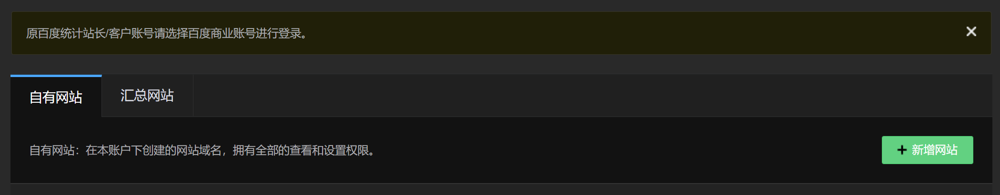
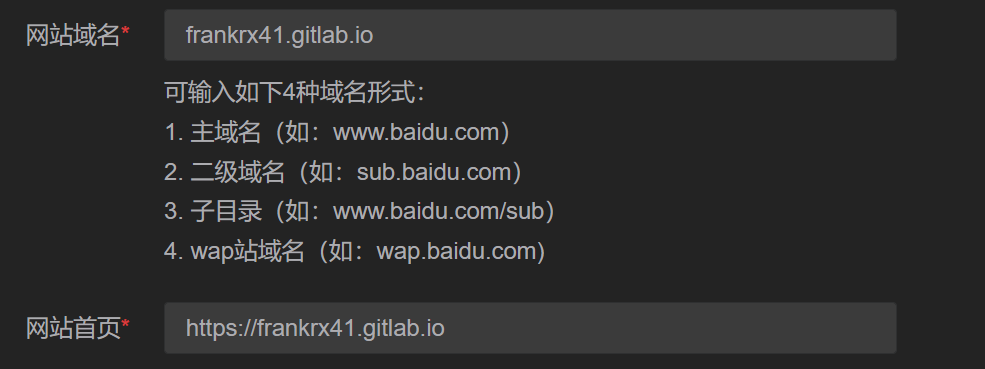
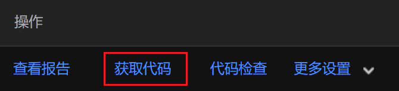
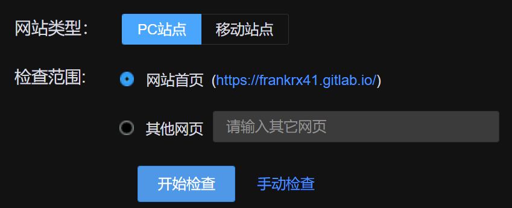

# 如何在本博客中加入百度统计

使用百度统计可以查看博客被访问的情况

## 给博客中加入百度统计

下面的步骤都是以我的博客为例子的

1. 在 [这里](https://tongji.baidu.com/web/welcome/login) 登录或注册一个百度账户

2. 点击 "使用设置"
    

3. 点击 "新增网站"
    

4. 输入你的博客信息

    这里是我的博客的示例
    

    > **Note** 如果你的博客由 `https://` 开头, 那 "网站首页" 请加上它. 百度默认是使用 http 协议来进行的访问

5. 点击 "获取代码", 按照百度的文档将代码放到博客中即可

    

6. 在博客中提交后, 重新登录, 并检查你的代码是否安装正确

    

将百度统计加入博客后, 就可以登录 [百度统计的主页](https://tongji.baidu.com/) 进行查看自己博客被浏览的情况了

## 本博客的特殊情况

因为本博客所有的页面都是先加载 index.html, 然后再在里面动态的更新内容

所以, 百度统计的识别代码只需要在 index.html 中放一次就好了

另外, 因为这个博客会同时部署到 github 和 gitlab 中, 按照百度统计的要求, 是需要两个不同的识别代码, 也就是需要为了 github 和 gitlab 制作两个不同的 index.html, 里面放上的各自不同的识别代码

但是我不打算这样做, 所以我加入了一个检查当前网站 url 的代码, 再根据当前网站的 url 返回给百度对应的识别码
