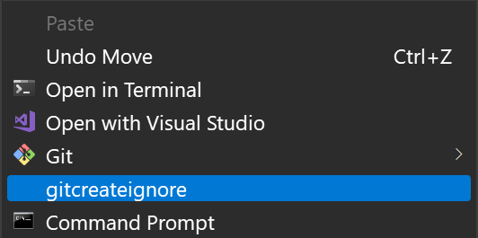
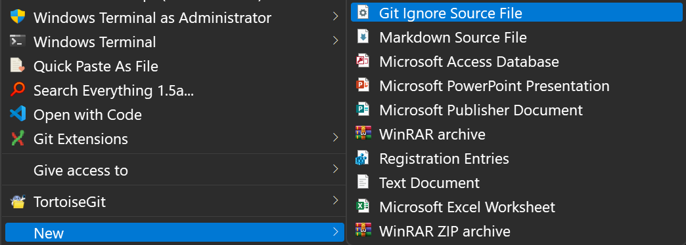
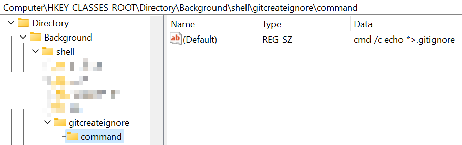
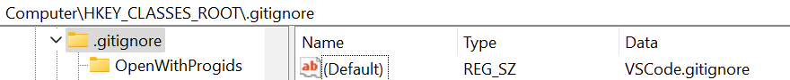
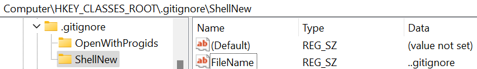

# How to quick create .gitignore in right menu

This article describes how to add a quick way to create a .gitignore file in the folder right-click menu.

We have two ways to create it, one is to add a new menu in the folder right-click menu, make it to create a .gitignore file immediately after being clicked.



The second way is to add the .gitignore file to the folder's New menu.



## Add a command to create .gitignore in right menu

> **Note** windows 8.1 system does not allow the direct creation of files starting with ".", this OS can only use this way.

First of all, we know that running the following command directly can create a .gitignore file this current folder and write "*" as the content to it.

```cmd
echo *>.gitignore
```

So all we have to do is, add this line of command to the context menu.

To do this, we follow the steps below:

1. Open regedit, create a key in

    ```reg
    HKEY_CLASSES_ROOT\Directory\Background\shell
    ```

    and name it `gitcreateignore` or other name you like.

1. Create a subkey under the key you just created, name it `command`.

1. Set the (default) value to:

    ```cmd
    cmd /c echo *>.gitignore
    ```

    

1. Ok, let's do a test. Right click in any folder background, you should see the menu like:

    

1. Click it, then there should be a .gitignore file with the content * created in this folder.

<!-- Here I also provide a way to put it into submenu.


 -->

## Add .gitignore type file in folder new menu

> **Note** I used the environment registered in the registry after vscode installation.

1. Goto `HKEY_CLASSES_ROOT\.gitignore` and set the (default) value to `VSCode.gitignore`.

    

1. Create a `ShellNew` key.

1. Create a `FileName` string value, and set it to `..gitignore`.

    

1. Open C:\\Windows\\ShellNew, Create a new "..gitignore" file by your self.

    And you can also add any content in it, like '*', or '#' etc.

1. Right click any folder, select new menu, you should see like:

    

    Click it, OS will create a "New Git Ignore Source File.gitignore" file, and the content of the file should be the same as C:\\Windows\\ShellNew\\..gitignore.
