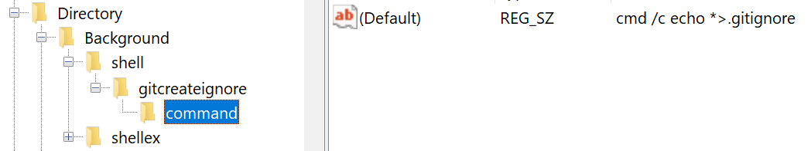
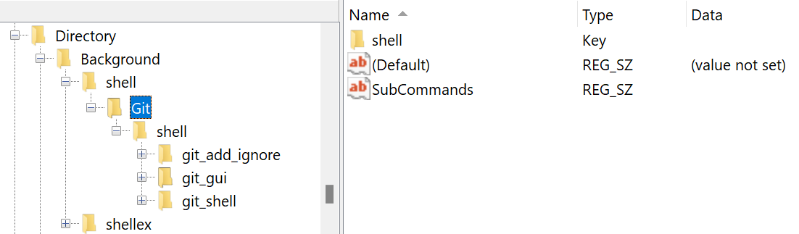
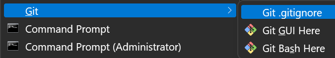
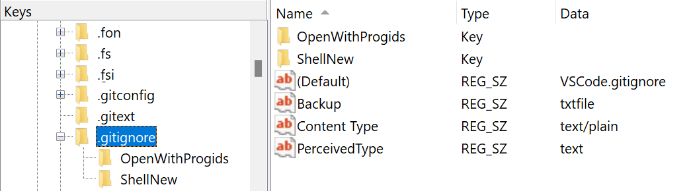
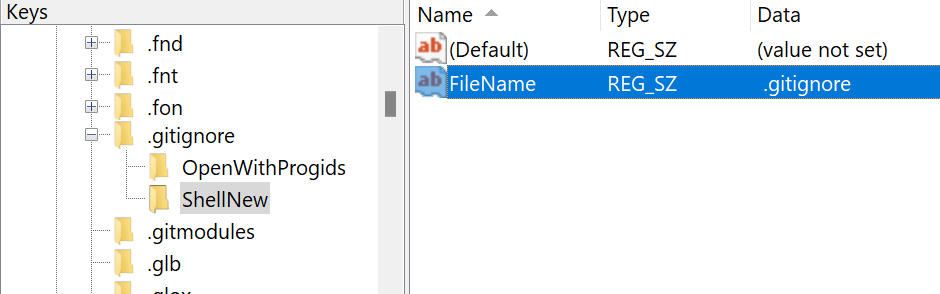
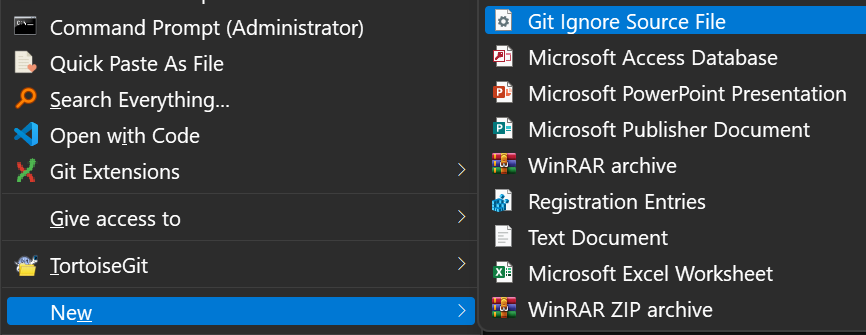

# How to add .gitignore in right menu

## In right menu

Because windows 8.1 system does not allow the direct creation of files starting with ".", we need to console command to create it.

First of all, we know that running the following command directly can create a .gitignore file and write "*" as the content to it.

```cmd
echo *>.gitignore
```

So all we have to do is, add this line of command to the context menu.

To do this, we follow the steps below:

1. Open regedit, create a key in `HKEY_CLASSES_ROOT\Directory\Background\shell` and name it `gitcreateignore` or other name you like.
1. Create a subkey under the key you just created, name it `command`.
1. Set the (default) value to `cmd /c echo *>.gitignore`

1. Ok, let's do a test. Right click in any folder background, you should see the menu like:

1. Click it, then there should be a .gitignore file with the content * created in this folder.

Here I also provide a way to put it into submenu.



## In new menu

In windows 11, we can directly create files starting with "."

1. Goto `HKEY_CLASSES_ROOT\.gitignore` and set the (default) value to `VSCode.gitignore`

2. Create `ShellNew`
FileName .gitignore

3. Open C:\Windows\ShellNew, Create a new .gitignore file by your self.
4. Right click any folder, select new menu, you should see like:

