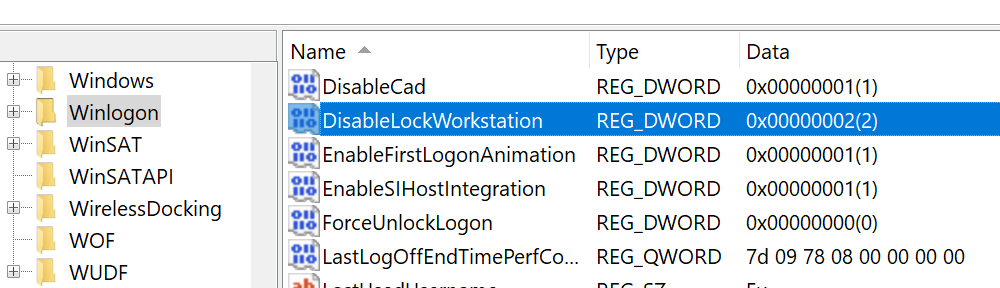

# How to disable `win` + `L` to lock PC in windows 11

We know that after pressing `win` + `L`, the system will lock the screen.

However, this function is very tasteless at some point.

We can use other third-party lock screen tools, or write one ourselves.

And it takes up a shortcut key starting with `win`, the most important thing is that this shortcut key cannot be modified, and even AHK's hook has no way to override it.

Therefore, the only way to disable `win` + `L` is to disable the lock screen function that comes with windows.

## Step

1. Open regedit and goto:

    ```reg
    HKEY_LOCAL_MACHINE\SOFTWARE\Microsoft\Windows NT\CurrentVersion\Winlogon
    ```

1. Set 'DisableLockWorkstation' value to '2'.

    

    > **Note** 1: enbale 2: disable

1. `win` + `l` should immediately stop working.
