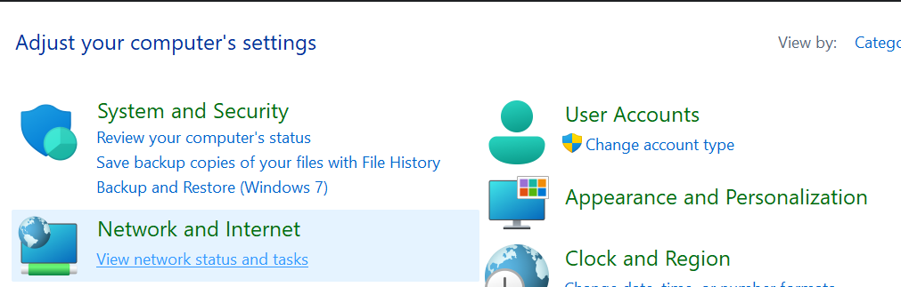

# How to find wifi password in windows 11

1. Open control panel.

1. Click "View network status and tasks"

    

1. Click your wifi name

    

1. Click "Wireless Properties" in WLAN Status window

    

1. Goto "Security" tab and check "Show characters" box.

    

> **tip**
>
> You can open control panel by type "control" in start > menu
> 
> or in Run window
> 
