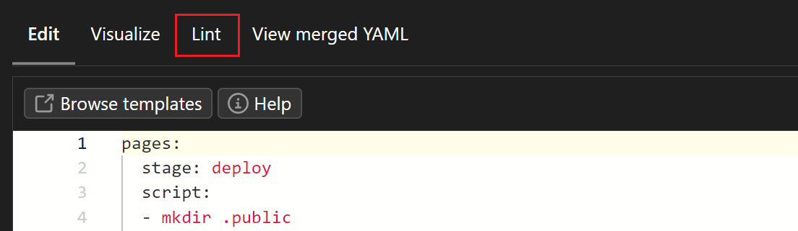

# 怎么把这个博客同时部署到 gitlab 上

经过测试, 我发现这个博客的框架在 gitlab 上部署是完全可行的

下面是我的 gitlab 的主页

<https://frankrx41.gitlab.io/>

这里我简单的说明一下如何进行部署

## 首先你应该知道

* "仓库" 这个东西, 在 github 叫做 repository, gitlab 叫做 project

* github 会自动的给 **和你用户名相同的仓库** 创建一个静态网站, 不需要我们做额外的操作, 但是 gitlab 需要我们手动创建一个 pipeline 来进行部署

* pipeline 在这里, 只需要简单的理解成让静态网页可以被访问的步骤就可以了, 具体就是通过 .gitlab-ci.yml 这个文件来实现的

## 在 gitlab 中需要做的步骤

1. 注册一个 gitlab 账户, 假设你的用户名叫做 "username"

1. 创建一个新的仓库, 并且这个仓库 **推荐** 被命名为 "username.gitlab.io"

1. 在项目里面创建一个 .gitlab-ci.yml 文件, 并且输入以下内容

    ```yml
    pages:
    stage: deploy
    script:
    - mkdir .public
    - cp -r * .public
    - mv .public public
    artifacts:
        paths:
        - public
    only:
    - main
    ```

    > **Tip**
    >
    > 你可以使用 Lint 工具检查你的 yml 文件是否有错误
    > 

1. 保存该文件并提交

1. 等待 pipeline 运行完毕, 确保 pipeline 成功

## 把这个仓库 push 到 gitlab 中

1. 在远端仓库中增加 gitlab 仓库的地址
    

1. push 到 gitlab 的分支中

    > **Note**
    >
    > * 如果使用 force push 的话, 注意要再传一份 .gitlab-ci.yml 文件
    > * gitlab 会默认保护主分支, 不允许 force push, 我们需要修改以下设置
    >     进入 /settings/repository 页面, 找到 Protected branches 选项, 把 Allowed to force push 打开
    >     

1. 最后一步, 点击 <https://username.gitlab.io> 访问你的网站

## 参考

* <https://www.youtube.com/watch?v=TWqh9MtT4Bg&ab_channel=GitLab>
* <https://docs.gitlab.com/ee/ci/yaml/#artifacts>
* <https://time2hack.com/host-your-static-site-on-gitlab-pages/>
* <https://docs.gitlab.com/ee/user/project/pages/getting_started/pages_from_scratch.html>
* <https://getpublii.com/docs/host-static-website-gitlab-pages.html>
* <https://stackoverflow.com/questions/28318599/git-push-error-pre-receive-hook-declined>
