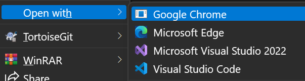
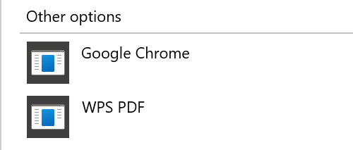
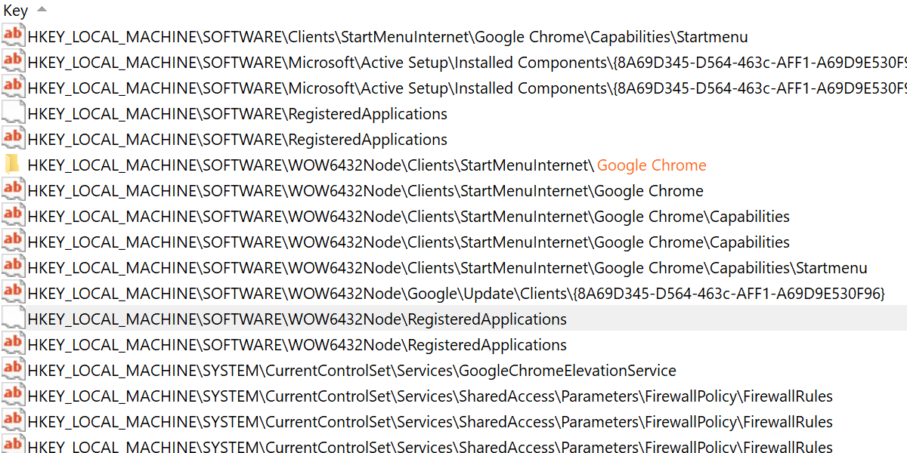
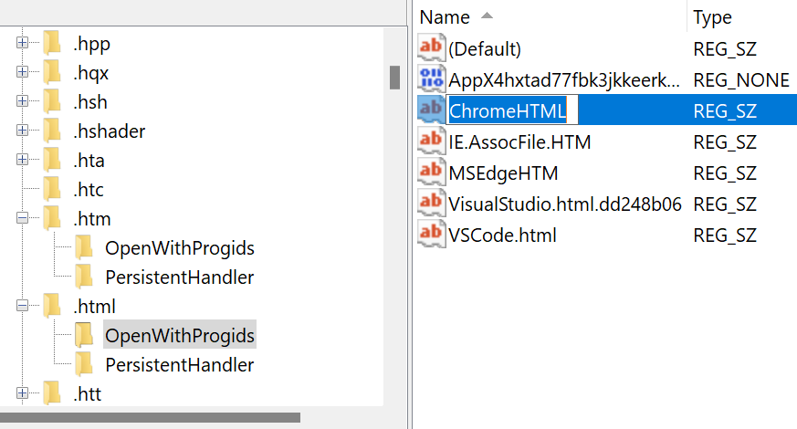
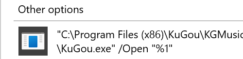
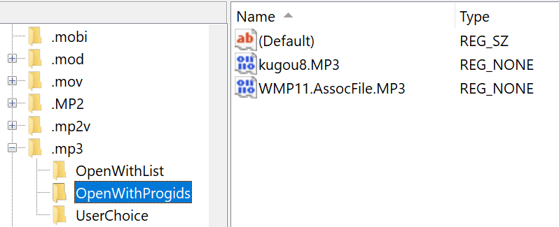
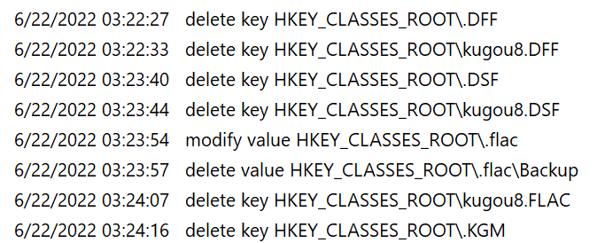

# How to remove app in open with list

We all know that there are many different file types in the computer, and each file has its own program to open it.

In Windows OS, programs that can open files of this type will be placed in **Open with** in the right-click menu.

As you can see, there are two deleted program in my right-click menu open with list.





Google Chrome and WPS PDF.

These software have been removed from this computer by me,
but their installation information remains in the registry.

Let me show you how to delete them.

P.S. I'm assuming you have a general understanding of computers and know what a registry is.

## WPS PDF

To find out where the Key is in the registry, I do follow:

1. Open regedit
1. Make a global search "WPS PDF"

Then I found the following locations:

```reg
HKEY_CLASSES_ROOT\Applications\wpspdf.exe
```

And I don't found a key that may be related to it elsewhere.
So I guess, this key is the information left in the registry.

After deleting this key, "WSP PDF" removed from open with list.

(You should make a **backup** of the registry in advance)

## Google Chrome in .html

To find out where the Key is in the registry, I do follow:

1. Open regedit
1. Make a global search "Google Chrome"

Unlike last time, this time I found a lot of similar keys.



So I switched my thinking and started with the file extension.

Because the extension of this file is `.html`, so I goto this location:

```reg
HKEY_CLASSES_ROOT\.html\OpenWithProgids
```



Here I found a suspicious key `ChromeHTML`, so I deleted it.

Later, "Google Chrome" was also removed from the open with list.

## Google Chrome in other extensions file

After that I look globally for the word ChromeHTML in the registry.
I found that in addition to `.html`, `.htm` `.shtml` `.svg` `.xht` `.xhtml` also have `ChromeHTML` in `OpenWithProgids` key.

I tried creating several files with these extensions and sure enough "Google Chrome" was in their open with list.

So I delete `HKEY_CLASSES_ROOT\ChromeHTML` and then "Google Chrome" was also removed from their open with list.

## KuGou8

In the process of searching, I found that there is a `kugou8` key in my registry.

I created an mp3 file, and in the open with list, there is indeed a kugou program.



From experience, I suspect it is and . mp3 this suffix is bound.
So I goto:

```reg
HKEY_CLASSES_ROOT\.mp3
```

And found a key `kugou8.mp3`



After I remove it, "Kugou" is remove from my open with list.

However, there are still many other files that are bundled with kugou. Like `.wav` `.flac` `.wma`

I'm a little tired, so I looked for kugou8 globally in the registry and deleted them all.


